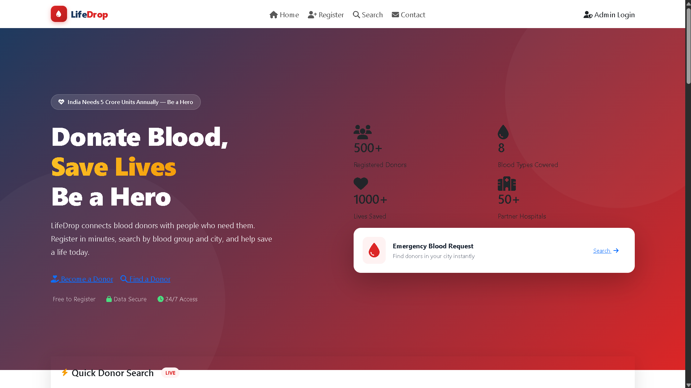
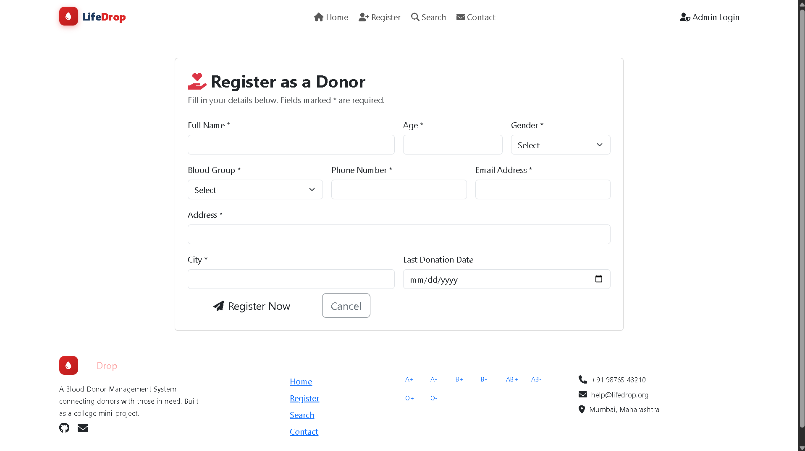
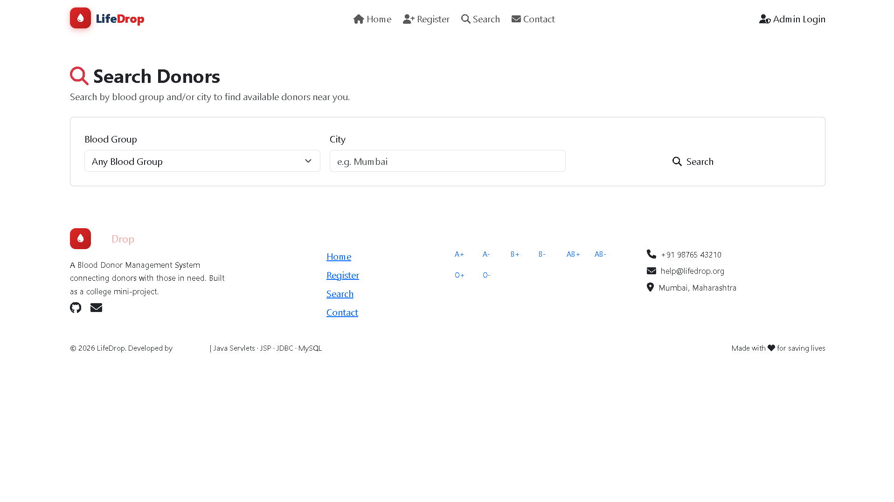
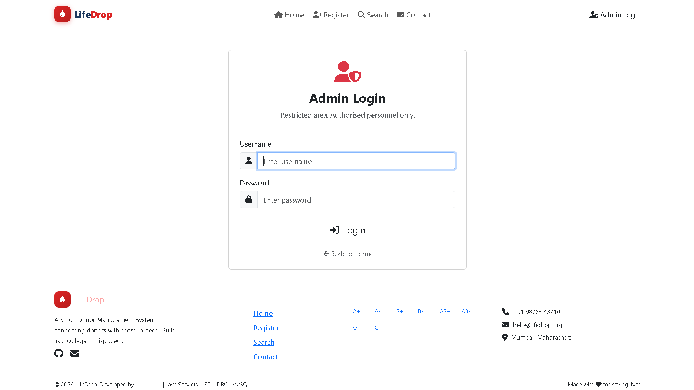

# LifeDrop - Blood Donor Management System

> A full-stack web application to manage blood donors, built as a Java college mini-project from scratch.


---

## Live Demo

| | Link |
|---|---|
| Live Site | https://lifedrop-app.up.railway.app |
| GitHub Repo | https://github.com/NikhilJain25106/BloodDonorManagementSystem |
| Admin Login | username: `admin` / password: `Admin@123` |

---

## Screenshots

### Home Page


### Donor Registration


### Search Donors


### Admin Dashboard


---

## About The Project

**LifeDrop** is a Blood Donor Management System that connects blood donors with people who need them urgently. Anyone can register as a donor or search for donors by blood group and city. A secure admin dashboard allows authorised personnel to manage all donor records.

This project was built **entirely from scratch** — no templates, no code generators — using Java Servlets, JSP, JDBC and MySQL, following the **MVC (Model-View-Controller)** architecture pattern.

---

## Features

### Public
- Home page with hero section, quick donor search, blood group browser
- Blood type compatibility chart
- Donor eligibility criteria
- FAQ section
- Donor registration with full server-side validation
- Search donors by blood group and/or city
- Contact page

### Admin
- Secure login with BCrypt password hashing
- Dashboard showing all donors with full contact details
- Edit any donor record
- Delete donor with confirmation
- Secure logout with full session invalidation

### Security
- BCrypt password hashing — passwords never stored as plain text
- PreparedStatement on every query — SQL injection impossible
- Server-side validation — cannot be bypassed like client-side JS
- AdminAuthFilter — centrally blocks all admin URLs without login
- Duplicate check — same phone or email cannot register twice
- Generic error messages — raw SQL errors never shown to users

---

## Built With

| Layer | Technology |
|-------|------------|
| Language | Java 17 |
| Web Layer | Java Servlets 4.0 + JSP |
| Database | MySQL 8.0 |
| DB Access | JDBC with PreparedStatement |
| Password Security | jBCrypt 0.4 |
| Frontend | Bootstrap 5.3 + Font Awesome 6.5 |
| Server | Apache Tomcat 9 (Embedded for deployment) |
| Build Tool | Apache Maven 3.9 |
| IDE | VS Code |
| Deployment | Railway (cloud) + Railway MySQL |

---

## Architecture — MVC Pattern

Browser Request
|
[Controller] Servlet

Reads form input
Validates server-side
Calls DAO layer
|
[Model] DAO + POJO
PreparedStatement SQL
Returns Donor / Admin objects
|
[View] JSP
Renders HTML response
|
Browser Response

---

## Project Structure

BloodDonorManagementSystem/
│
├── database/
│ └── schema.sql # MySQL schema + sample data
│
├── screenshots/ # Project screenshots for README
│
├── src/main/java/com/blooddonor/
│ ├── model/
│ │ ├── Donor.java # Donor data class
│ │ └── Admin.java # Admin data class
│ ├── dao/
│ │ ├── DonorDAO.java # Donor CRUD + search + duplicate check
│ │ └── AdminDAO.java # Admin login lookup
│ ├── servlet/
│ │ ├── RegisterDonorServlet.java
│ │ ├── SearchDonorServlet.java
│ │ ├── AdminLoginServlet.java
│ │ ├── AdminLogoutServlet.java
│ │ ├── AdminDashboardServlet.java
│ │ ├── UpdateDonorServlet.java
│ │ └── DeleteDonorServlet.java
│ ├── filter/
│ │ └── AdminAuthFilter.java # Blocks unauthenticated admin access
│ └── util/
│ ├── DBConnection.java # JDBC connection (supports Railway env vars)
│ ├── PasswordUtil.java # BCrypt hash and verify
│ └── GenerateAdminHash.java # One-time admin account setup
│
├── src/main/webapp/
│ ├── index.jsp # Home page
│ ├── register.jsp # Donor registration form
│ ├── search.jsp # Search donors
│ ├── admin-login.jsp # Admin login
│ ├── admin-dashboard.jsp # Admin CRUD table
│ ├── edit-donor.jsp # Edit donor form
│ ├── contact.jsp # Contact page
│ ├── includes/
│ │ ├── header.jsp # Shared navbar
│ │ └── footer.jsp # Shared footer
│ ├── assets/
│ │ ├── css/style.css # Custom healthcare theme
│ │ └── js/validation.js # Client-side validation
│ └── WEB-INF/
│ └── web.xml # App config + session timeout
│
├── nixpacks.toml # Railway build config
├── Procfile # Railway start command
└── pom.xml # Maven dependencies


---

## Database Schema

### donors
| Column | Type | Notes |
|--------|------|-------|
| donor_id | INT AUTO_INCREMENT | Primary key |
| full_name | VARCHAR(100) | Required |
| age | INT | Must be 18-65 |
| gender | ENUM | Male / Female / Other |
| blood_group | ENUM | A+ A- B+ B- AB+ AB- O+ O- |
| phone | VARCHAR(15) UNIQUE | 10 digits |
| email | VARCHAR(100) UNIQUE | Valid format |
| address | VARCHAR(255) | Required |
| city | VARCHAR(50) | Required |
| last_donation_date | DATE | Nullable |
| created_at | TIMESTAMP | Auto-filled |

### admin_users
| Column | Type | Notes |
|--------|------|-------|
| admin_id | INT AUTO_INCREMENT | Primary key |
| username | VARCHAR(50) UNIQUE | Login username |
| password_hash | CHAR(60) | BCrypt hash, never plain text |
| full_name | VARCHAR(100) | Display name |
| created_at | TIMESTAMP | Auto-filled |

---

## Getting Started

### Prerequisites
- JDK 17
- Apache Tomcat 9
- MySQL 8.0
- Maven 3.9+
- VS Code with Extension Pack for Java

### Step 1 — Clone
```bash
git clone https://github.com/NikhilJain25106/BloodDonorManagementSystem.git
cd BloodDonorManagementSystem
```

### Step 2 — Database setup
```bash
mysql -u root -p < database/schema.sql
```

### Step 3 — Configure DB password
Open `src/main/java/com/blooddonor/util/DBConnection.java`
Update the local fallback section with your MySQL root password.

### Step 4 — Create first admin account
Run `GenerateAdminHash.java` in VS Code (right-click the file → Run Java).
Copy the printed INSERT statement and run it in MySQL Workbench.

Default credentials: **username:** `admin` | **password:** `Admin@123`

### Step 5 — Build
```bash
mvn clean package
```

### Step 6 — Deploy to Tomcat
```bash
# Windows
copy target\BloodDonorManagementSystem.war C:\tomcat9\webapps\
C:\tomcat9\bin\startup.bat
```

### Step 7 — Open in browser

http://localhost:8080/BloodDonorManagementSystem/


---

## Daily Startup

```bash
C:\tomcat9\bin\startup.bat
```

Then visit: http://localhost:8080/BloodDonorManagementSystem/

---

## Pages

| Page | URL | Access |
|------|-----|--------|
| Home | `/` | Public |
| Register Donor | `/registerDonor` | Public |
| Search Donors | `/searchDonors` | Public |
| Contact | `/contact.jsp` | Public |
| Admin Login | `/adminLogin` | Public |
| Admin Dashboard | `/adminDashboard` | Admin only |
| Edit Donor | `/editDonor?id=X` | Admin only |
| Delete Donor | `/deleteDonor?id=X` | Admin only |
| Logout | `/adminLogout` | Admin only |

---

## Security Decisions

| Threat | How We Handle It |
|--------|-----------------|
| SQL Injection | PreparedStatement — user input is always data, never SQL text |
| Plain text passwords | BCrypt with random salt via jBCrypt library |
| Unauthorized dashboard access | AdminAuthFilter runs before any admin servlet |
| Client-side validation bypass | All rules re-enforced server-side in Java |
| Session after logout | session.invalidate() destroys the session object entirely |
| Duplicate registrations | isDuplicateDonor() checks phone AND email before INSERT |
| Leaking database errors | Generic message shown to user, real exception logged server-side |

---

## Deployment (Railway)

This app is deployed on Railway using an embedded Tomcat server.

Environment variables used:
- `MYSQLHOST` — database host
- `MYSQLPORT` — database port
- `MYSQLDATABASE` — database name
- `MYSQLUSER` — database username
- `MYSQLPASSWORD` — database password

The app automatically detects Railway environment variables and switches from local config to cloud config at startup.

---

## Contributing

1. Fork the repository
2. Create a feature branch (`git checkout -b feature/NewFeature`)
3. Commit your changes (`git commit -m "Add NewFeature"`)
4. Push to the branch (`git push origin feature/NewFeature`)
5. Open a Pull Request

---

## Developer

**Nikhil Jain**
- GitHub: [@NikhilJain25106](https://github.com/NikhilJain25106)

---

## License

This project is built as a college mini-project for educational purposes.

---

*Built with Java Servlets, JSP, JDBC and MySQL — deployed on Railway*